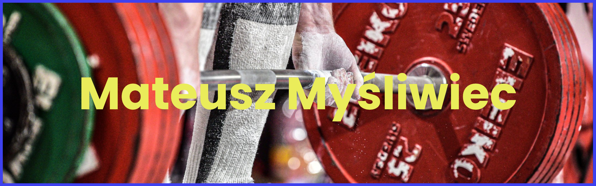

- 🔭 I’m currently working on **develop my programming skills (python, C++)**

- 🌱 I’m currently learning **AWS, Azure and trading skills**

- 👨‍💻 My python projects are available at [python repo](https://github.com/MatMysliwiec/Projekty_python)

- 👨‍💻 My C++ projects are available at [C++ repo](https://github.com/MatMysliwiec/ProjectC)

- 📫 How to reach me **mateuszmysliwiec3@outlook.com**

- 📄 Know about my experiences [https://www.linkedin.com/in/mateusz-my%C5%9Bliwiec-8972a7238/](https://www.linkedin.com/in/mateusz-my%C5%9Bliwiec-8972a7238/)
<h3>Skills:
</h3> 

  

